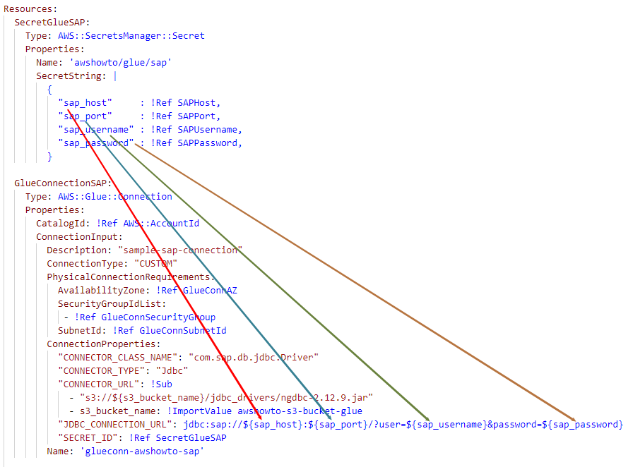

- [How to Connect AWS Glue to Snowflake and SAP HANA Databases](#how-to-connect-aws-glue-to-snowflake-and-sap-hana-databases)
  - [General Steps to setup up Glue to work with JDBC sources](#general-steps-to-setup-up-glue-to-work-with-jdbc-sources)
  - [Prerequisites](#prerequisites)
  - [Connecting to Snowflake](#connecting-to-snowflake)
    - [Download JDBC driver and upload to s3 bucket](#download-jdbc-driver-and-upload-to-s3-bucket)
    - [Create secret, glue connection and sample job](#create-secret-glue-connection-and-sample-job)
    - [Verify connectivity](#verify-connectivity)
  - [Connecting to SAP HANA](#connecting-to-sap-hana)
    - [Download JDBC driver and upload to s3 bucket](#download-jdbc-driver-and-upload-to-s3-bucket-1)
    - [Create secret, glue connection and sample job](#create-secret-glue-connection-and-sample-job-1)
    - [Verify connectivity](#verify-connectivity-1)
  - [Clean Up](#clean-up)
    - [Delete Snowflake-related resources](#delete-snowflake-related-resources)
    - [Delete SAP-related resources](#delete-sap-related-resources)
    - [Delete S3 bucket](#delete-s3-bucket)
- [How to store Glue Connection's credentials in Secrets Manager](#how-to-store-glue-connections-credentials-in-secrets-manager)


<a id="introduction"></a>
# How to Connect AWS Glue to Snowflake and SAP HANA Databases

If you're looking to set up AWS Glue jobs and connections to work with Snowflake and SAP HANA databases, this article provides a step-by-step guide to help you get started. 

In this article we also provide CloudFormation code for creating the necessary resources, as well as best practices for storing credentials in Secrets Manager rather than in the connection itself.

Described approach can be applied to other JDBC sources as well.

<a id="general-steps"></a>
## General Steps to setup up Glue to work with JDBC sources

Before you get started, make sure you have an S3 bucket to store your Glue job scripts and artifacts, such as JDBC drivers.
You can create a bucket using the steps in the prerequisites section of this guide.

Then follow these general steps to **set up Glue to work with JDBC sources**:

1. Download the **JDBC driver** and upload it into your Glue S3 bucket.
2. **Create a secret** in Secrets Manager to stores your credentials.
3. **Create a Glue connection** that references the JDBC string, the JDBC driver location on S3, and the previously created secret.

**To test the connectivity**, follow these additional steps:

4. **Create a Glue job** (sample code is provided in the "glue" folder).
5. **Run the Glue job** to test the connectivity.

<a id="prerequisites"></a>
## Prerequisites

In this section we'll create a bucket to hold the sample Glue job scripts and JDBC drivers with the following command:
```bash
aws cloudformation create-stack --stack-name cf-awshowto-glueconn-010-s3 \
    --template-body file://cloudformation/010_s3.yaml
```

By default, cloudformation stack creates a bucket named "s3-awshowto-glueconn-${AWS::AccountId}-glue".  
You can change the name it by modifying "cloudformation/010_s3.yaml" file.

The following steps for Snowflake and SAP HANA can be executed independently.

<a id="snowflake"></a>
## Connecting to Snowflake

### Download JDBC driver and upload to s3 bucket

Run the following commands to upload Snowflake JDBC driver into your S3 bucket:

Notes:
* More recent version of JDBC driver might be available at the time you read this. 
You can substitute the URL in the first line of code with updated one. Additionally, you will need to modify driver's filename in cloudformation/020_glue_snowflake.yaml (GlueConnectionSnowflake resource)
* Make sure to replace {{s3_bucket_name}} with the name of bucket created in prerequisites section.

```bash
wget -N -P jdbc_drivers/ https://repo1.maven.org/maven2/net/snowflake/snowflake-jdbc/3.13.16/snowflake-jdbc-3.13.16.jar

aws s3 cp jdbc_drivers/snowflake-jdbc-3.13.16.jar s3://{{s3_bucket_name}}/jdbc_drivers/
```

### Create secret, glue connection and sample job

1. **Fill in values in cloudformation/snowflake_parameters.json:**


Parameters include:
- Snowflake credentials to store in Secrets Manager
- Availability Zone, Subnet and Security Group which are used to create Glue Connection

2. **Create resource as CloudFormation Stack**

Run the following command:
```bash
aws cloudformation create-stack --stack-name cf-awshowto-glueconn-020-glue-snowflake --capabilities CAPABILITY_NAMED_IAM \
    --template-body file://cloudformation/020_glue_snowflake.yaml --parameters file://cloudformation/snowflake_parameters.json
```

This creates the following resources:
* *Secret in AWS Secrets Manager*
* *Glue Connection*

  Glue Connection refers to the previously created Secret. This is a more secure way to store credentials rather then storing them inside Glue connection itself.  
  For more information - refer to [this section](#use-secret-in-glue-connection).

* *IAM Role for Sample Glue Job*

  It provides minimum required permission for the sample glue job to run.

* *Sample Glue Job to test connectivity*

  Job source code is located in glue/sample_snowflake_job.py and contains a snippet demonstrating how to connect to Snowflake from pySpark job and execute simple query.

In order to upload Glue Job script onto S3, run the following command (replace {{s3_bucket_name}} with actual S3 bucket name):
```bash
aws s3 cp glue/sample_snowflake_job.py s3://{{s3_bucket_name}}/scripts/
```

### Verify connectivity

To confirm that our sample Glue Job can successfully connect to Snowflake, we'll run it using the following command:

```bash
aws glue start-job-run --job-name gluejob-awshowto-snowflake-sample
```

This will trigger the job, which can be monitored in the AWS Glue console. Once the job completes, you can check its logs to verify that it was able to connect to Snowflake and execute the query successfully.

<a id="sap"></a>
## Connecting to SAP HANA

### Download JDBC driver and upload to s3 bucket

Run the following commands to upload SAP JDBC driver into your S3 bucket:

Notes:
* More recent version of JDBC driver might be available at the time you read this. 
You can substitute the URL in the first line of code with updated one. Additionally, you will need to modify driver's filename in cloudformation/030_glue_sap.yaml (GlueConnectionSAP resource)
* Make sure to replace {{s3_bucket_name}} with the name of bucket created in prerequisites section.

```bash
wget -N -P jdbc_drivers/ https://repo1.maven.org/maven2/com/sap/cloud/db/jdbc/ngdbc/2.12.9/ngdbc-2.12.9.jar

aws s3 cp jdbc_drivers/ngdbc-2.12.9.jar s3://{{s3_bucket_name}}/jdbc_drivers/
```

### Create secret, glue connection and sample job

1. **Fill in values in cloudformation/sap_parameters.json:**


Parameters include:
- SAP credentials to store in Secrets Manager
- Availability Zone, Subnet and Security Group which are used to create Glue Connection

2. **Create resource as CloudFormation Stack**

Run the following command:
```bash
aws cloudformation create-stack --stack-name cf-awshowto-glueconn-030-glue-sap --capabilities CAPABILITY_NAMED_IAM \
    --template-body file://cloudformation/030_glue_sap.yaml --parameters file://cloudformation/sap_parameters.json
```

This creates the following resources:
* *Secret in AWS Secrets Manager*
* *Glue Connection*

  Glue Connection refers to the previously created Secret. This is a more secure way to store credentials rather then storing them inside Glue connection itself.  
  For more information - refer to [this section](#use-secret-in-glue-connection).

* *IAM Role for Sample Glue Job*

  It provides minimum required permission for the sample glue job to run.

* *Sample Glue Job to test connectivity*

  Job source code is located in glue/sample_sap_job.py and contains a snippet demonstrating how to connect to SAP from pySpark job and execute simple query.

In order to upload Glue Job script onto S3, run the following command (replace {{s3_bucket_name}} with actual S3 bucket name):
```bash
aws s3 cp glue/sample_sap_job.py s3://{{s3_bucket_name}}/scripts/
```

### Verify connectivity

To confirm that our sample Glue Job can successfully connect to SAP, we'll run it using the following command:

```bash
aws glue start-job-run --job-name gluejob-awshowto-sap-sample
```

This will trigger the job, which can be monitored in the AWS Glue console. Once the job completes, you can check its logs to verify that it was able to connect to SAP and execute the query successfully.

## Clean Up

Note: Both Snowflake and SAP clean-up sections contain explicit Secret deletion (not via CloudFormation) with "force-delete-without-recovery"
It makes possible to delete and recreate sample stacks multiple times.  
Otherwise, AWS performs "soft delete" of the secret and it will lead to an error if you try to create stack within next 30 days.

### Delete Snowflake-related resources

Run the following commands:
```
aws secretsmanager delete-secret --secret-id awshowto/glue/snowflake --force-delete-without-recovery

aws cloudformation delete-stack --stack-name cf-awshowto-glueconn-020-glue-snowflake
```

### Delete SAP-related resources

Run the following commands:
```
aws secretsmanager delete-secret --secret-id awshowto/glue/sap --force-delete-without-recovery

aws cloudformation delete-stack --stack-name cf-awshowto-glueconn-030-glue-sap
```

### Delete S3 bucket

Don't forget to put actual S3 bucket name:
```
aws s3 rm s3://{{s3_bucket_name}}/ --recursive

aws cloudformation delete-stack --stack-name cf-awshowto-glueconn-010-s3
```

<a id="use-secret-in-glue-connection"></a>
# How to store Glue Connection's credentials in Secrets Manager

Storing credentials as properties in a Glue Connection is not recommended as it is not secure.  
A better alternative is to store them in AWS Secrets Manager and refer to the secret in your Glue Connection.


To set this up, you'll need to:

1. Create a secret in AWS Secrets Manager with JSON-formatted attributes (such as username and password).
    You can refer to the Secrets defined in the "cloudformation/020_glue_snowflake.yaml" or "cloudformation/030_glue_sap.yaml".

2. Create a Glue Connection
    "JDBC_CONNECTION_URL" attribute should contain JDBC string with placeholders (e.g. {username}) that match the names of the attributes in your secret.
    The placeholders will be replaced with actual values from secrets at runtime when connecting to database.




3. Sample pySpark code for connecting to JDBC Data Source using Glue Connection:

```python
connection_name = "glueconn-awshowto-sap"
connection_type = "custom.jdbc"
connection_options = { "query": query, "connectionName": connection_name}

dynamic_frame = glueContext.create_dynamic_frame.from_options(
        connection_type=connection_type,
        connection_options=connection_options,
        transformation_ctx="dynamic_frame"
)
```


