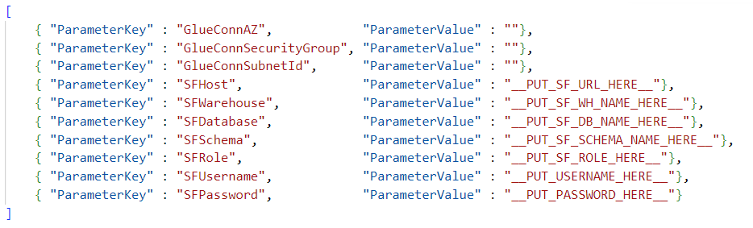
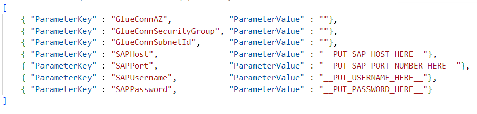

- [How to Connect AWS Glue to Snowflake and SAP HANA Databases](#how-to-connect-aws-glue-to-snowflake-and-sap-hana-databases)
  - [General Steps to setup up Glue to work with JDBC sources](#general-steps-to-setup-up-glue-to-work-with-jdbc-sources)
  - [Prerequisites](#prerequisites)
  - [Connecting to Snowflake](#connecting-to-snowflake)
    - [Download JDBC driver and upload to s3 bucket](#download-jdbc-driver-and-upload-to-s3-bucket)
    - [Creating secret, glue connection and sample job](#creating-secret-glue-connection-and-sample-job)
    - [Testing connectivity](#testing-connectivity)
  - [Connecting to SAP HANA](#connecting-to-sap-hana)
    - [Download JDBC driver and upload to s3 bucket](#download-jdbc-driver-and-upload-to-s3-bucket-1)
    - [Creating secret, glue connection and sample job](#creating-secret-glue-connection-and-sample-job-1)
    - [Testing connectivity](#testing-connectivity-1)
  - [Clean Up](#clean-up)
    - [Delete Snowflake-related resources](#delete-snowflake-related-resources)
    - [Delete SAP-related resources](#delete-sap-related-resources)
    - [Delete S3 bucket](#delete-s3-bucket)
- [How to store Glue Connection's credentials in Secrets Manager](#how-to-store-glue-connections-credentials-in-secrets-manager)


<a id="introduction"></a>
# How to Connect AWS Glue to Snowflake and SAP HANA Databases

If you're looking to set up AWS Glue jobs and connections to work with Snowflake and SAP HANA databases, this article provides a step-by-step guide to help you get started. 

We also provide CloudFormation code for creating the necessary resources, as well as best practices for storing credentials in Secrets Manager rather than in the connection itself.

Described approach can be applied to other JDBC sources as well.

<a id="general-steps"></a>
## General Steps to setup up Glue to work with JDBC sources

Before you get started, make sure you have an S3 bucket to store your Glue job scripts and artifacts, such as JDBC drivers
(it can also be created using steps from Prerequisites section of this guide).

Then follow these general steps to **set up Glue to work with JDBC sources**:

1. Download the **JDBC driver** and upload it into your Glue S3 bucket.
2. **Create a secret** in Secrets Manager that stores your credentials.
3. **Create a Glue connection**:
    - Provide a JDBC string.
    - Reference the JDBC driver location on S3.
    - Reference the previously created secret.

**To test the connectivity**, follow these additional steps:

4. **Create a Glue job** (sample code is provided in the "glue" folder).
5. **Run the Glue job** to test the connectivity.

<a id="prerequisites"></a>
## Prerequisites

In this step we create a bucket where we place the sample glue job scripts and JDBC drivers.
```bash
aws cloudformation create-stack --stack-name cf-awshowto-glueconn-010-s3 \
    --template-body file://cloudformation/010_s3.yaml
```

By default, it creates bucket named "s3-awshowto-glueconn-${AWS::AccountId}-glue".  
You can change the name it by modifying cloudformation/010_s3.yaml.

The following steps for Snowflake and SAP HANA can be executed independently.

<a id="snowflake"></a>
## Connecting to Snowflake

### Download JDBC driver and upload to s3 bucket

Run the following commands to upload Snowflake JDBC driver into your S3 bucket.

Notes:
* More up-to-date version of JDBC driver might be available when you're reading this. You can replace the url in the first line of code below. Also you will need to change the file name in cloudformation/020_glue_snowflake.yaml (GlueConnectionSnowflake resource)
* Please replace {{s3_bucket_name}} with the bucket created in prerequisites section.

```bash
wget -N -P jdbc_drivers/ https://repo1.maven.org/maven2/net/snowflake/snowflake-jdbc/3.13.16/snowflake-jdbc-3.13.16.jar

aws s3 cp jdbc_drivers/snowflake-jdbc-3.13.16.jar s3://{{s3_bucket_name}}/jdbc_drivers/
```

### Creating secret, glue connection and sample job

1. **Fill in values in cloudformation/snowflake_parameters.json:**



Parameters include:
- Snowflake credentials to store in Secrets Manager
- Availability Zone, Subnet and Security Group which are used to create Glue Connection

2. **Create resource as CloudFormation Stack**

Run the following command:
```bash
aws cloudformation create-stack --stack-name cf-awshowto-glueconn-020-glue-snowflake --capabilities CAPABILITY_NAMED_IAM \
    --template-body file://cloudformation/020_glue_snowflake.yaml --parameters file://cloudformation/snowflake_parameters.json
```

This creates the following resources:
* *Secret in AWS Secrets Manager*
* *Glue Connection*

  Glue Connection refers to the previously created Secret. This is a more secure way to store credentials rather then storing them inside Glue connection itself.  
  For more information - refer to [this section](#use-secret-in-glue-connection).

* *IAM Role for Sample Glue Job*

  It provides minimal required permission for the sample glue job.

* *Sample Glue Job to test connectivity*

  Job source code can be found in glue/sample_snowflake_job.py.
  It contains a snippet on howto connect to Snowflake from pySpark job and execute simple query.

In order to upload Glue Job script onto S3, run the following command (don't forget to put actual S3 bucket name there):
```bash
aws s3 cp glue/sample_snowflake_job.py s3://{{s3_bucket_name}}/scripts/
```

### Testing connectivity

Now we want to run our sample Glue Job to ensure it connects to Snowflake successfully:
```bash
aws glue start-job-run --job-name gluejob-awshowto-snowflake-sample
```

<a id="sap"></a>
## Connecting to SAP HANA

### Download JDBC driver and upload to s3 bucket

Run the following commands to upload SAP JDBC driver into your S3 bucket.

Notes:
* More up-to-date version of JDBC driver might be available when you're reading this. You can replace the url in the first line of code below. Also you will need to change the file name in cloudformation/030_glue_sap.yaml (GlueConnectionSAP resource)
* Please replace {{s3_bucket_name}} with the bucket created in prerequisites section.

```bash
wget -N -P jdbc_drivers/ https://repo1.maven.org/maven2/com/sap/cloud/db/jdbc/ngdbc/2.12.9/ngdbc-2.12.9.jar

aws s3 cp jdbc_drivers/ngdbc-2.12.9.jar s3://{{s3_bucket_name}}/jdbc_drivers/
```

### Creating secret, glue connection and sample job

1. **Fill in values in cloudformation/sap_parameters.json:**



Parameters include:
- SAP credentials to store in Secrets Manager
- Availability Zone, Subnet and Security Group which are used to create Glue Connection

2. **Create resource as CloudFormation Stack**

Run the following command:
```bash
aws cloudformation create-stack --stack-name cf-awshowto-glueconn-030-glue-sap --capabilities CAPABILITY_NAMED_IAM \
    --template-body file://cloudformation/030_glue_sap.yaml --parameters file://cloudformation/sap_parameters.json
```

This creates the following resources:
* *Secret in AWS Secrets Manager*
* *Glue Connection*

  Glue Connection refers to the previously created Secret. This is a more secure way to store credentials rather then storing them inside Glue connection itself.  
  For more information - refer to [this section](#use-secret-in-glue-connection).

* *IAM Role for Sample Glue Job*

  It provides minimal required permission for the sample glue job.

* *Sample Glue Job to test connectivity*

  Job source code can be found in glue/sample_sap_job.py.
  It contains a snippet on howto connect to SAP from pySpark job and execute simple query.

In order to upload Glue Job script onto S3, run the following command (don't forget to put actual S3 bucket name there):
```bash
aws s3 cp glue/sample_sap_job.py s3://{{s3_bucket_name}}/scripts/
```

### Testing connectivity

Now we want to run our sample Glue Job to ensure it connects to SAP successfully:
```bash
aws glue start-job-run --job-name gluejob-awshowto-sap-sample
```

## Clean Up

Note: Both Snowflake and SAP clean-up sections contain explicit Secret deletion (not via CloudFormation) with "force-delete-without-recovery"
It makes possible to delete and recreate sample stacks multiple times.  
Otherwise, AWS performs "soft delete" of the secret and it will lead to an error if you try to create stack within next 30 days.

### Delete Snowflake-related resources

Run the following commands:
```
aws secretsmanager delete-secret --secret-id awshowto/glue/snowflake --force-delete-without-recovery

aws cloudformation delete-stack --stack-name cf-awshowto-glueconn-020-glue-snowflake
```

### Delete SAP-related resources

Run the following commands:
```
aws secretsmanager delete-secret --secret-id awshowto/glue/sap --force-delete-without-recovery

aws cloudformation delete-stack --stack-name cf-awshowto-glueconn-030-glue-sap
```

### Delete S3 bucket

Don't forget to put actual S3 bucket name:
```
aws s3 rm s3://{{s3_bucket_name}}/ --recursive

aws cloudformation delete-stack --stack-name cf-awshowto-glueconn-010-s3
```

<a id="use-secret-in-glue-connection"></a>
# How to store Glue Connection's credentials in Secrets Manager

TODO:


