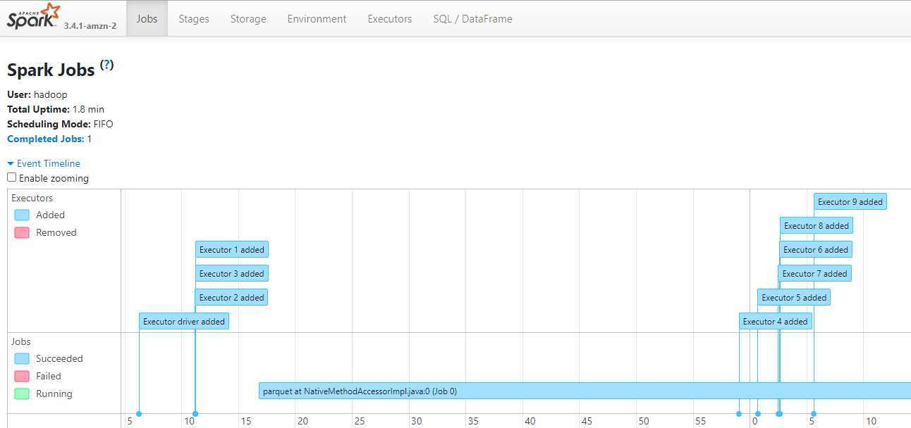
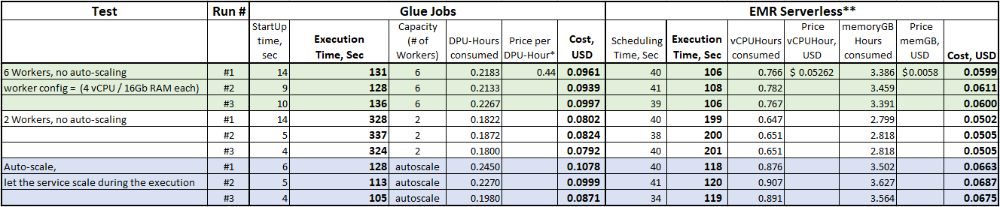

# Choosing between AWS Glue and EMR Serverless for your Big Data Workloads

## Introduction

AWS provides a wide range of serverless technologies to run Big Data processing.
Sometimes those services have similar goals and it's difficult to choose - which one suits your needs better.
One good example is AWS Glue Jobs and EMR Serverless.

In this article we:
1. Cover some functional differences and service integrational aspects which might affect your choice
2. Provide benchmark test results (representing on one of typical steps in incremental data workloads)
3. Discuss scenarios where one technology or another could prevail

Disclaimer: in this article we focus on Glue Jobs specifically, paying less attention to other Glue capabilities whose purpose is not
data processing specifically. Nevertheless, Data Catalog and Crawlers might be essential part of you Data Platform no matter which
processing technology would you choose (Glue Jobs or EMR Serverless): they integrate with both very well.

## Functional aspects

### Service Maturity

**AWS Glue** was made generally available in 2017 (6 years ago - quite a long journey to these days standard) and got several major version upgrades making the service faster, more user-friendly and adding some additional capabilities.

**EMR Serverless** became GA only in mid-2022, but I wouldn't call it worrysome, as it was built taking experience from classic EMR on EC2.

Both services have a very good documentation and, also, github repositories with samples where you can get loads of code examples and explore usage best practices: [aws-glue-samples](https://github.com/aws-samples/aws-glue-samples), [emr-serverless-samples](https://github.com/aws-samples/emr-serverless-samples)

### Compatibility: Big Data Technology Stack

**EMR Serverless**: you can run Spark (PySpark, Scala, JAVA, SparkR) and HIVE jobs (as of time of this writing. The list is likely to be expanded in future).  
**AWS Glue**: support Spark only (PySpark and Scala scripts).  
In Glue you can also run pure Python code cheaply (using just 0.0625 of standard workers capacity), but it's not a scope for this article.

**Version upgrades**: EMR Serverless tends to be closer to the latest available Spark version as they declare 60 days interval to adopt newly released Spark versions while AWS Glue gets upgrades not that often.  

Current versions (as of 2023-12-29):  
**EMR Serverless**: version 6.15.0 -> Apache Spark 3.4.1 [link](https://docs.aws.amazon.com/emr/latest/EMR-Serverless-UserGuide/release-versions.html)
**AWS Glue**: AWS Glue 4.0 -> Spark 3.3.0 [link](https://docs.aws.amazon.com/glue/latest/dg/release-notes.html)

### Compatibility: Open-table formats

It is easy to use both **EMR Serverless** and **Glue** to work with Open table formats (Hudi, Iceberg, Delta Lake).

- In Glue you just provide job parameter (e.g. *"--datalake-formats":"iceberg"* and some minimal spark configuration)
- In EMR-Serverless - you provide spark configuration options such as *spark.jars=/usr/lib/hudi/hudi-spark-bundle.jar*
- Using Open Table format is very well documented for both services

### Compatibility: AWS eco-system integration 

Both services are tightly integrated with such **core AWS services** as IAM, VPC, CloudFormation etc.
The same can be said for services typically used in data pipelines: S3 (not only for data, but for logs also), Data Catalog/Crawlers and many others.
Specifically 

Database and orchestration tools integration we'll discuss a bit later.

**AWS Glue Data Catalog**, even though it's a part of AWS Glue service, integrates with EMR just as easy.  
Providing this option for EMR serverless job run is sufficient (and it's a part of defaults as well):
```json
    "sparkSubmitParameters": {
        "spark.hadoop.hive.metastore.client.factory.class": "com.amazonaws.glue.catalog.metastore.AWSGlueDataCatalogHiveClientFactory"
    }
```

### Job Scheduling and orchestration

1. Apache Airflow

Airflow provides easy-to-use operators for both Glue and EMR Serverless Jobs.
That's how running the job looks for EMR:
```python
from airflow.providers.amazon.aws.operators.emr import EmrServerlessStartJobOperator

    job_operator = EmrServerlessStartJobOperator(
        task_id="you_task_id",
        application_id=EMR_SERVERLESS_APPLICATION_ID,
        execution_role_arn=JOB_ROLE_ARN,
        job_driver={
            "sparkSubmit": {
                "entryPoint": f"s3://{S3_BASE_BUCKET}/scripts/your_script.py",
                "entryPointArguments": [S3_BASE_BUCKET]
            }
        }
    )
```

There are some additional operator when, for example in less common scenarios, you can create and tear-down the whole EMR Serverless application as well as running several jobs in between.

Both are equally well-integrated with Apache Airflow.

2. Step Functions

AWS-native orchestration service integrates with services in our scope very well and the implementation is done in similar way.

Defining State Machine task for Glue Job Run:
```json
"GlueJobRun": {
      "Type": "Task",
      "Resource": "arn:aws:states:::glue:startJobRun.sync",
      "Parameters": {
        "JobName": "my-glue-job"
      }
      ...
    },
```

You can run asynchronously or wait for job completion using ".sync".

3. There's a native orchestration mechanism for Glue - Glue Workflows. Of course, it seamlessly integrates with Glue and not
available for EMR Serverless.
But as this option is less advanced than Airflow or Step Function, we wouldn't consider having it as a big advantage for Glue.

### Integration: Databases and data providers

1. AWS Databases: Redshift, RDS, Aurora

Typical approach in **EMR Serverless** (as well as in just plain PySpark) would be using JDBC:
```python
from pyspark.sql import SparkSession

spark = SparkSession.builder.getOrCreate()

df = (
    spark.read.format("jdbc")
    .option(
        "url", "jdbc:postgresql://<host_name>:<port>/<db_name>"
    )
    .option("driver", "org.postgresql.Driver")
    .option("user", "<username>")
    .option("password", "<password>")
    .load()
)
```
And, of course, you will need to retrieve DB credentials first (most likely from Secrets Manager).

In **AWS Glue** you can use built-in mechanism of Glue Connections, where you define connection properties alongside with
credentials (best practice is to reference pre-created secret). Then you can just like this:

```python
dynamic_frame_read = glueContext.create_dynamic_frame.from_options(
    connection_type="postgresql",
    connection_options={
        "connectionName": connection_name
        "dbtable": table_name,
        ...        
    }
)
```

This, in our opinion, makes it easier to implement database integrations in AWS Glue Jobs.

2. Other common data stores

There might be a requirement in your data platform to interact with third-party data stores. It might be SAP HANA, Snowflake,
databases in Azure Cloud etc.
AWS Glue provides out-of-the-box connectors for many data stores like these (and list is growing).

This saves your from hassle of picking correct JDBC driver, downloading it and integrating it into your job and, then, maintaining driver version etc. (which would be exactly EMR Serverless scenario for majority of data stores).

AWS Glue takes an upperhand here as well.

## Observability

AWS Glue got some nice additions lately, so it's fair to say that both services provide a very good set of capabilities to
monitor job and investigate potentials bottlenecks/painpoints.

**EMR Studio** provides Spark UI (for running jobs) and Spark History server (for completed ones) visualization for each job run you have.
Alternatively, you can generate a job run's temporary URL for Spark UI dashboard using AWS SDK or CLI commands.



**AWS Glue** also provides sufficient capabilities in that regard. Even better, there were several recent improvement adding
observability metrics and Spark UI:


### Service-Specific features

AWS Glue provides several enhancements which might accelerate or ease the development process including:
- Dynamic Data Frame which has some nice method for easier data reads/writes integrating with AWS Glue Connections and AWS Glue Data Catalog
- Job bookmarks

From development perspective having those additions might be considered as an advantage for AWS Glue Jobs.

## Benchmark test

The main purpose of this test was to compare services cost and performance. In other words, which one would be cheaper to
process a portion of data and how the execution time compares.

As a test workload we used a scenario where we take a S3-based csv dataset, perform data type conversion and save the data 
into another S3 location. This could be considered as a simulation of one of the steps in batch processing (incremental load from raw to stage layer).

For dataset we took NewYork taxi (yellow taxi) rides data for 2022, which is sized around 4Gb in csv format.
This represents well the typical size of incremental data batch, which doesn't usually exceed several Gb.

Source code for running the tests, execution logs and detailed results file you can find in [git repo](benchmark_test/README.md).
Please don't consider this as a comprehesive test, but rather as a measurement for one particular (and also common) data
processing scenario.

How do we ran tests:
1. We ran the same workload in three different setups for each service:
  - 6 workers, no auto-scaling. Each worker size = 4 vCPU and 16 Gb memory (this is Standard Glue workers size. In EMR we set up worker size through job run configuration)
  - 2 workers, no auto-scaling. Same worker size
  - Auto-scaling. We let the service decide how to auto-scale, observing how it works using default settings.
2. For each setup we executed 3 runs and gathering:
  - job execution time (also we pay attention to "warm-up" time needed to provision running infrastructure)
  - resource consumption relevant to billing (for Glue it is DPU-hours consumed, for EMR Serverless: vCPU-hours and memoryGb-hours).



[*] - prices are taken for us-east-1 region.  
[**] - here we disregard cost of storage GB because: 1) our tests fit very well in 20Gb free of charge storage per worker, 2) additional Gb cost is $0.000111, which is negligible

### Test takeaways

1. Total cost of job runs where approximately 1.5 lower in EMR Serverless (among all configurations and runs)
2. Job Execution time (here we consider billed time only, no warm-ups) was 1.2-1.6 times faster for EMR in no-auto-scale scenario and almost equal for auto-scaling.
3. If we take "total completion time" (warm-up + execution) - it's almost equal for 6 workers setup, better for EMR in 2 workers scenario, and in Glue's favor for auto-scale.
4. EMR Serverless job lifecycle contains the following state transitions: Pending (application start) -> Scheduled (resource provisioning) -> Running (actual execution)
5. We calculated "scheduled" time as warm-up - i.e. time needed to provision infrastructure. "Pending" is only relevant for runs executed in EMR Serverless application after long pauses in between. Otherwise, it's negligible.
6. We didn't use "preinitialized capacity" feature in EMR Serverless (as it would give this service the upperhand and 
would make the test not-really serverless).
7. Execution time varies between runs in the same setup. However, for EMR the difference between max and min execution time is in range of 1-2%, while for Glue it can variate up to 15%.
8. In Glue testing script we used spark Data Frame functionality. We considered using Glue Dynamic Data Frame instead, but it didn't show any benefits (you can see this script results in "log_results" folder).
9. Minimum billed time for vCPUHour is 1 minute. For shorter jobs, reported resources consumption might differ from actually billed resource consumption. For our test it was the case only for autoscale setup and the difference (as we checked manually in EMR Studio) was in a range of 1-2%, negligible.

## Conclusion

<<todo>>
There are several scenarios when you can prefer using EMR serverless:
- You intend to use something apart from PySpark
- You are migrating existing Big Data codebase into serverless platform. So even you PySpark jobs require less changes (adding GlueContext; parsing parameters using awsglue.utils getResolvedOptions etc.)
- Your workload elements tend to be small (e.g. 1 job just processing several gigabytes of data per run), so you can allocate less capacity
- Scenario: close to "lift-and-shift" migration scenario from EMR or Hadoop cluster

btw, if you are planning migration from existing EMR to EMR serverless, you might want to consider using EMR serverless cost estimator. [https://aws.amazon.com/blogs/big-data/amazon-emr-serverless-cost-estimator/]