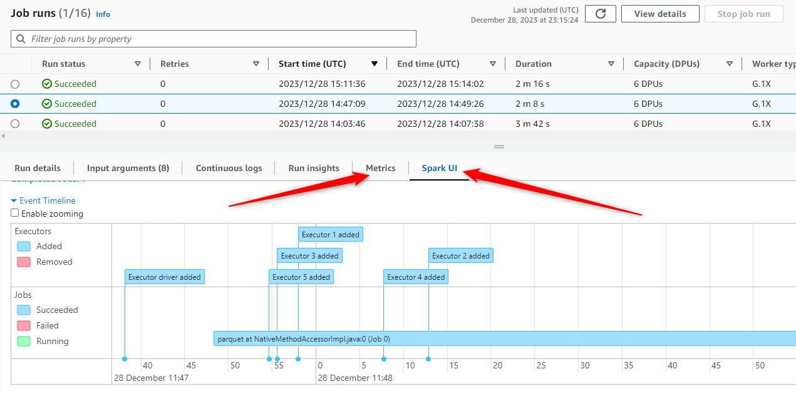

# Choosing between AWS Glue and EMR Serverless for your Big Data Workloads

## Introduction

AWS offers a wide range of serverless technologies for Big Data processing. Often, these services have overlapping functionalities, making it challenging to determine the best fit for your specific needs. A good example of this is the comparison between AWS Glue Jobs and EMR Serverless.

In this article, we aim to:
1. Highlight key functional differences and aspects of service integration that could influence your choice.
2. Present results of a benchmark test that represents a typical scenario in incremental data workloads.
3. Explore various scenarios where one technology may outperform the other.

Disclaimer: AWS Glue offers a variety of tools, but our research here focuses on Glue Jobs because it's most relevant for the comparison with EMR Serverless.  
Other AWS Glue components, like the Data Catalog and Crawlers can be vital part of any data plaform and, as we will explore later, they don't act as differentiators as they integrate smoothly with both Glue Jobs and EMR Serverless.

## Functional aspects

### Service Maturity

**AWS Glue** became generally available in 2017. Over the past six years, it has seen continuous improvement, marked by several major version upgrades that have enhanced the service, making it faster, more user-friendly, and expanding its capabilities.

**EMR Serverless**, on the other hand, was launched as generally available only in mid-2022. However, concerns about its relative newness are mitigated by the fact that it was developed using insights gained from the classic EMR on EC2.

Both services have an extensive documentation and, also, github repositories with samples where you can get loads of code examples and explore usage best practices: [aws-glue-samples](https://github.com/aws-samples/aws-glue-samples), [emr-serverless-samples](https://github.com/aws-samples/emr-serverless-samples)

### Compatibility: Big Data Technology Stack

**EMR Serverless**: As of the time of this writing, EMR Serverless supports running Spark (PySpark, Scala, JAVA, SparkR) and HIVE jobs. The range of compatible technologies is likely to expand in the future.

**AWS Glue**: Primarily supports Spark (PySpark and Scala scripts). Additionally, AWS Glue offers the capability to run pure Python code efficiently, using only 0.0625 of the standard worker's capacity. However, this feature falls outside the scope of this article.

**Version Upgrades**: EMR Serverless generally stays more up-to-date with the latest Spark versions, aiming to adopt new releases within a 60-day timeframe. In contrast, AWS Glue tends to receive updates less frequently.

Current versions (as of 2023-12-29):  
**EMR Serverless**: version 6.15.0 -> Apache Spark 3.4.1 [link](https://docs.aws.amazon.com/emr/latest/EMR-Serverless-UserGuide/release-versions.html)
**AWS Glue**: AWS Glue 4.0 -> Spark 3.3.0 [link](https://docs.aws.amazon.com/glue/latest/dg/release-notes.html)

### Compatibility: Open-table formats

Both **EMR Serverless** and **AWS Glue** facilitate easy interaction with open table formats (Hudi, Iceberg, and Delta Lake).

- In AWS Glue, simply add a job parameter (e.g. *"--datalake-formats":"iceberg"* and some minimal spark configuration)
- For EMR Serverless, specify Spark configuration options, such as *spark.jars=/usr/lib/hudi/hudi-spark-bundle.jar*
- Using Open Table format is very well documented for both services

### Compatibility: AWS ecosystem integration 

Both services integrate seamlessly with **core AWS services** like IAM, VPC, CloudFormation, etc. This extends to services commonly used in data pipelines, such as S3 (for data storage and logging), Data Catalog/Crawlers, and many others.

We'll discuss database and orchestration tool integration later in the article.

**AWS Glue Data Catalog**, while part of the AWS Glue service, integrates with EMR just as easily. For EMR Serverless jobs, configuring the following option is sufficient (and is included in the default settings):
```json
    "sparkSubmitParameters": {
        "spark.hadoop.hive.metastore.client.factory.class": "com.amazonaws.glue.catalog.metastore.AWSGlueDataCatalogHiveClientFactory"
    }
```

### Job Scheduling and orchestration

1. Apache Airflow

Airflow provides easy-to-use operators for both Glue and EMR Serverless Jobs.
Here's an example of how a EMR Serverless job can be run using Airflow:
```python
from airflow.providers.amazon.aws.operators.emr import EmrServerlessStartJobOperator

    job_operator = EmrServerlessStartJobOperator(
        task_id="you_task_id",
        application_id=EMR_SERVERLESS_APPLICATION_ID,
        execution_role_arn=JOB_ROLE_ARN,
        job_driver={
            "sparkSubmit": {
                "entryPoint": f"s3://{S3_BASE_BUCKET}/scripts/your_script.py",
                "entryPointArguments": [S3_BASE_BUCKET]
            }
        }
    )
```

There are some additional operators when, for example in less common scenarios, you can create and tear-down the whole EMR Serverless application as well as running several jobs in between.

Both are equally well-integrated with Apache Airflow.

2. Step Functions

AWS-native orchestration service integrates smoothly with both services in our scope and the implementation is done in similar ways.

Defining State Machine task for Glue Job Run:
```json
"GlueJobRun": {
      "Type": "Task",
      "Resource": "arn:aws:states:::glue:startJobRun.sync",
      "Parameters": {
        "JobName": "my-glue-job"
      }
      ...
    },
```

Jobs can be run asynchronously or set to wait for completion using ".sync".

3. AWS Glue also offers a native orchestration mechanism – Glue Workflows.  While this integrates seamlessly with Glue, it is not available for EMR Serverless. However, Glue Workflows are generally less advanced than Airflow or Step Functions, so their absence in EMR Serverless is not a significant disadvantage.

### Integration: Databases and data providers

1. AWS Databases: Redshift, RDS, Aurora

For **EMR Serverless** (as well as for just plain PySpark), the typical method for database integration is through JDBC.  
Here’s an example of how you can connect to a database using PySpark:
```python
from pyspark.sql import SparkSession

spark = SparkSession.builder.getOrCreate()

df = (
    spark.read.format("jdbc")
    .option(
        "url", "jdbc:postgresql://<host_name>:<port>/<db_name>"
    )
    .option("driver", "org.postgresql.Driver")
    .option("user", "<username>")
    .option("password", "<password>")
    .load()
)
```
And, of course, you will need to retrieve database credentials first (most likely from Secrets Manager).

In contrast, **AWS Glue** simplifies database integration with its built-in Glue Connections where you define connection properties and credentials (ideally referencing a pre-created secret).  
Database interaction using Glue Connection is very easy:

```python
dynamic_frame_read = glueContext.create_dynamic_frame.from_options(
    connection_type="postgresql",
    connection_options={
        "connectionName": connection_name
        "dbtable": table_name,
        ...        
    }
)
```

This, in our opinion, makes it easier to implement database integrations in AWS Glue Jobs.

2. Other common data stores

Your data platform might need to interface with third-party data stores such as SAP HANA, Snowflake, or databases in Azure Cloud. **AWS Glue** offers ready-to-use connectors for many such data stores, and the list is constantly expanding.

Using AWS Glue saves you the trouble of selecting and maintaining the correct JDBC driver, a process that is necessary in **EMR Serverless** for most third-party data stores. This ease of integration gives AWS Glue an advantage in scenarios involving diverse data sources.

## Observability

Recently, AWS Glue has seen significant improvements in its observability features, bringing it on par with EMR Serverless in terms of capabilities for monitoring jobs and identifying potential bottlenecks or issues.

**EMR Serverless** provides effective job monitoring tools. It includes the Spark UI for real-time tracking of running jobs and the Spark History Server for insights into completed ones. For convenience, monitoring can be done via EMR Studio UI or by generating a Spark UI dashboard URL for specific job runs using AWS SDK or CLI commands.


**AWS Glue** recent enhancements have introduced more observability metrics and access to the Spark UI, providing detailed insights into job performance.:



### Service-Specific features

AWS Glue stands out with several unique features that can speed up and simplify the development process. These include:
- Dynamic Data Frames offering convenient methods for data reads/writes, these frames integrate seamlessly with AWS Glue Connections and the AWS Glue Data Catalog.
- Job bookmarks.

From development perspective having those additions might be considered as an advantage for AWS Glue Jobs.

## Benchmark test

The primary goal of our benchmark test was to evaluate the cost-effectiveness and performance of AWS Glue Jobs versus EMR Serverless. Specifically, we aimed to determine which service is more economical for data processing and how their execution times compare.

We simulated a common batch processing step: loading data from "raw" to "stage" layer. Our test involved processing a ~4GB CSV dataset of New York taxi (yellow taxi) ride data from 2022, stored on S3. This dataset size is in typical range for incremental data batches (which is usually up to several GBs).  
Workload includes reading data from S3, data type conversion and writing to a different S3 location in parquet format.

You can find the source code, execution logs, and detailed results of our test in our [GitHub repository](benchmark_test/README.md).    
Note that this test represents a specific data processing scenario and is not intended as a comprehensive evaluation.

### Test Methodology

1. We ran the same workload under three different setups for each service:
  - 6 workers, no auto-scaling, with each worker having 4 vCPU and 16 GB memory. (this is Standard Glue workers size. In EMR we set up worker size through job run configuration)
  - 2 workers, no auto-scaling, with the same worker specifications
  - Auto-scaling. We let the service decide how to auto-scale, observing how it works using default settings.
2. We conducted three runs for each setup, measuring:
  - job execution time (also we pay attention to "warm-up" time needed to provision running infrastructure)
  - resource consumption relevant to billing (DPU-hours for Glue and vCPU-hours and memoryGb-hours for EMR Serverless).


[*] - prices are taken for us-east-1 region.  
[**] - here we include vCPU and memoryGb cost only, disregarding the cost of storageGB because: 1) our tests fit very well in 20Gb free of charge storage per worker, 2) additional Gb cost is $0.000111, which is negligible

### Test takeaways

1. EMR Serverless was approximately 1.5 times more cost-effective than AWS Glue across various configurations.
2. In scenarios without auto-scaling, EMR Serverless was 1.2 to 1.6 times faster than Glue. With auto-scaling, the execution times were almost identical. Here we consider billed time only, no warm-ups.
3. Total completion time (including warm-up and execution) was comparable for both services with 6 workers, faster for EMR with 2 workers, and in Glue’s favor with auto-scaling.
4. EMR Serverless job lifecycle contains the following state transitions: Pending (application start) -> Scheduled (resource provisioning) -> Running (actual execution)
5. We calculated "scheduled" time as warm-up - i.e. time needed to provision infrastructure. "Pending" is only relevant for runs executed in EMR Serverless application longer periods of inactivity. Otherwise, it's negligible.
6. We didn't use "preinitialized capacity" feature in EMR Serverless to maintain an apples-to-apples comparison.
7. Variability in execution times from one run to another in the same setup was more pronounced in Glue, with up to a 15% difference, whereas EMR Serverless showed a tighter range of 1-2%.
8. In Glue testing script we used spark Data Frame functionality. We considered using Glue Dynamic Data Frame instead, but it didn't show any benefits in this scenario (you can see this script results in "log_results" folder).
9. Minimum billed time for EMR vCPUHour is 1 minute. For shorter jobs, reported resources consumption might differ from actually billed resource consumption. For our test it was the case only for autoscale setup and the difference (as we checked manually in EMR Studio) was in a range of 1-2%, negligible.

## Conclusion

In our exploration of AWS Glue Jobs and EMR Serverless, we've closely examined their functionality, integration capabilities, cost-effectiveness, and performance.  
Based on our benchmark tests and observations, here are some key takeaways:


**Cost-Effectiveness**: The tests indicate that EMR Serverless could be more cost-effective in certain scenarios. This aligns with current AWS pricing (please note, we use the current prices, while they can change in future):

- AWS Glue is priced at **$0.44** per DPU-hour (4 vCPU + 16 Gb RAM)
- EMR pricing is $0.052624 per vCPU per hour and $0.0057785 per GB per hour. So, for "4 vCPU + 16 Gb RAM" configuration the price tag is **$0.30**.
- Further savings may be possible with EMR's Linux/ARM workers, although compatibility with specific workloads should be tested.

**Performance**: When evaluating performance, it's crucial to consider both execution and warm-up times. For EMR Serverless, scheduling time may impact time-sensitive workloads. The preinitialized capacity feature can mitigate this but requires balancing cost against performance.

**Integration and Usability**: Both services offer robust integration with AWS services, but AWS Glue's built-in connections provide an edge in simplicity and ease of setup, particularly for data stores integrations.

**Potential use-cases**:
If you are considering moving your on-premises Hadoop or EMR-on-EC2 cluster to a serverless platform, EMR Serverless presents a viable option, potentially enabling a smooth, close to "lift-and-shift" migration.

Conversely, for smaller projects with intensive data integrations involving diverse sources like SAP HANA or Snowflake, AWS Glue Jobs may be preferable due to lower development efforts.
