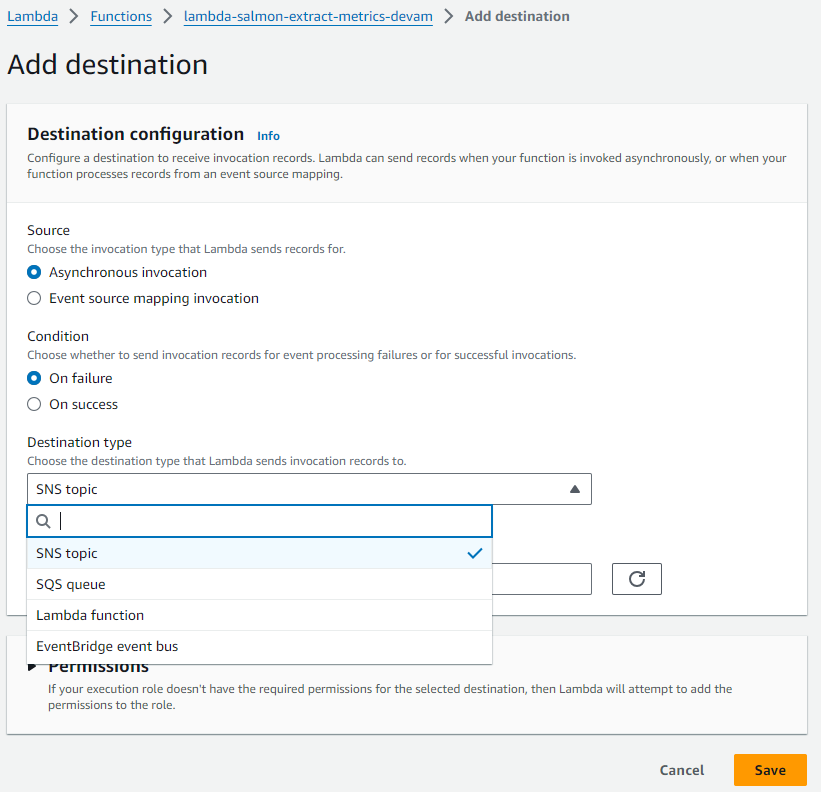
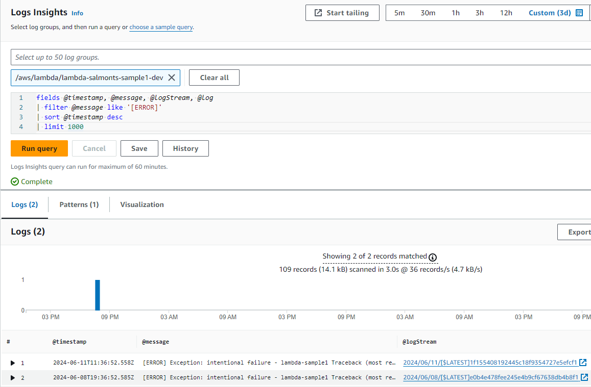

# Monitoring Data Pipelines on AWS. Part 1: Specifics, challenges and AWS Toolset

In this two-part article we will to cover several aspects related to monitoring data pipelines running on AWS:
1. How is monitoring data pipelines different from any general-purpose observability tools?
2. What are typical goals of these observability systems? 
3. What are the common challenges we face when building such system?
4. AWS tools and services useful for this purpose
5. How we've built an open-source monitoring system on top of AWS toolset to help users addresses monitoring challenges easier and more efficiently

What we describe here is based on our experience and pain points we heard from our customers.

## How monitoring data pipelines is different from any generic observability tools?

When we think about "typical" monitoring system, the first thing comes to mind is watching over CPU load of EC2 instance or container, and, when needed, reacting to load changes by scaling up or down as needed.  
In the domain of Data Pipelines, observations are done on a more "discrete" level. We focus more on pipeline steps - whether they have completed successfully or failed, and whether they met their SLAs, among other factors.
This requires a slightly different approach and, consequently, a different toolset.

Additionally, the set of metrics we may want to collect is also dictated by the "discrete" nature of observing data pipelines.  
There are obvious metrics such as "execution time" of each pipeline step.  
However, it's equally important to collect "extended" metrics. For example, DPU-hours consumed by a Glue job is a crucial one. A Glue job might fit within the expected execution timeframe but consume significantly more resources if Spark autoscaling spins up additional workers. Therefore, having those extended metrics might help ensure efficient resource utilization and cost management.

## Goals of monitoring

1. Ensure all pipelines are running smoothly with minimal time and effort required from the operations team.
2. Detect failures as soon as possible and receive clear notifications in case of an error. Notifications should detail what happened, where it happened, and assist in identifying the root cause. Additionally, maintaining a history of incidents for retrospective analysis is beneficial.
3. Detect potential issues, such as a Glue job taking progressively longer to complete, which may risk breaking the SLA in the future (e.g., one day it might not complete in time to update data for downstream reports).
4. Have a graphical, easy-to-understand representation of the current state of data pipelines and their execution history. It's preferable to have a centralized location where data about the numerous pipelines within the organization can be accessed.

## Challenges

Let's explore some challenges typically encountered when building monitoring solutions in the data domain.  
All of them are real-life cases that we solved together with our customers.

1. **Multiple Pipelines in Scope**: There are often numerous pipelines to monitor, belonging to different projects and managed by different teams.

- It’s beneficial to introduce a common organization-wide standard (or even a ready-to-use solution) that project teams can adopt instead of reinventing the wheel each time.
- When introducing a centralized monitoring system, it should be able to distinguish one project from another. For instance, in case of a job X failure, alerts should be sent only to the team managing the relevant project.

2. **Resource Distribution Across Multiple AWS Accounts and Regions**: It is common for organizations to distribute resources among multiple AWS accounts and regions.

- It’s crucial to ensure that monitoring data (such as alerts and metrics) are properly fetched into a centralized platform.
- This involves setting up cross-account relationships, ensuring cross-account permissions are as restrictive as possible, and minimizing the footprint of data gathering.

3. **Varied Technology Stacks**: Different projects may use different technology stacks (e.g., one team might use Glue, while another relies on EMR).

The centralized platform should be capable of handling events from a variety of services.

4. **Non-Invasive Implementation**: Building a centralized observability platform should not require changes to the actual pipelines' codebase. This consideration is important for legacy projects, which can be difficult to change, also we can't rely on multiple teams 100% following coding guidelines.

5. **Non-trivial cases**, such "detect when something didn't happen". For example, if a daily processing pipeline starts when a third party uploads a file to S3, not receiving this file on time should trigger a notification to the relevant support team.

## AWS Tools and Services

In this section, let's take a look at some AWS Services which can be useful when building the monitoring platform, their typical use cases, pros and cons.

### Triggering Alerts: Amazon EventBridge
AWS EventBridge is an event-driven service that fits very well in scenarios where you need to detect events from AWS resources.  
The default out-of-the-box EventBus receives events from a majority of AWS services.  
Therefore, you can set up EventBridge Rules to react to certain AWS events in your account and send those events to a target, where you can process those and send notifications.  
The service provides extensive capabilities for filtering relevant events. For example, you can catch event only from the "glue" service with the event type "Glue Job State Change" when the target state indicates "something went wrong".  
Additionally, you can limit the scope of the rule to glue jobs only relevant to your needs (see the example below).

```yaml
      EventPattern:
        source:
          - aws.glue
        detail-type:
          - Glue Job State Change
        detail:
          state:
            - FAILED
            - ERROR
            - STOPPED
          jobName:
            - prefix: glue-myproject
```

AWS lets you choose from a variety of services to be a target of this event.  
For our purpose the following seem to be most useful:
- SNS topic - if you just want to send event "as is" to alerts recipients
- SQS queue or Lambda function - if you want to apply additional processing (formatting, beautification for better readility or enriching the message with more details).

We found this to be a very nice and efficient way of catching failures. It is easy to setup and flexible.

Unfortunately not all services are supported (at time of this writing). For example, you can't catch Glue Workflow or Lambda function failures.
Additionally, it takes additional effort to start handling events from another AWS account.

### Catching Lambda Failures: Lambda Destinations

Configuring Lambda Destinations is a great way to get notifications on Lambda failure.
When function fails, it sends an event to the target of your choice (currently available options are SNS, SQS, Lambda and Eventbridge).



There are several downsides:
- it only works when lambda is invoked asynchronously
- it requires Lambda function configuration changes (which, as we discussed in "Challenges" section, not always possible).

### Notifications: AWS SNS vs AWS SES

When the monitoring system identifies a failure, it's time to send a notification to relevant recipients.

The first candidate service for this is AWS SNS. It's easy to set up and integrates very well with AWS services.  
For example, if you set up EventBridge rule (see above), it's a matter of 1 click to set up an SNS Topic as destination.
All topic's subscribers will get the notification. However, the notification itself often looks like a big chunk of JSON and lacks readability.

It would be nice to have a formatted message, which outlines the most important aspects of what has happened, making operation team's life easier.

One option here is to use a combination of AWS Lambda and SES (which is capable of sending nice HTML e-mails).
You can choose processing Lambda as event target, do some parsing and formatting in Lambda code and, then, call SES to deliver the notification.

Generally speaking, when you use processing lambda function as a target, you can send notification in differen ways, such as to Slack or MS Teams channels. However, this requires additional efforts for integrations.

### Historical analysis: Cloudwatch LogInsights

AWS services accumulate their logs in CloudWatch, and you can use LogInsight tool to query these events in nice, intuitive manner.
For example, that's how you can identify the history of errors of a certain Lambda function:



However, for some other services, unlike AWS Lambda, it might require additional coding efforts to store sufficient information about errors (or events in general).

Also, we need to keep in mind, AWS charges based on volume of data (cloudwatch logs) scanned.

### Gathering execution metrics: AWS SDK, AWS CLI

Apart from getting on-failure notification, you might want to collect some execution metrics for future analysis.
For example, you want to gather daily Glue Job running time and DPU-hours consumed.
AWS provides access to this information over the API, which you can call either using AWS CLI or via AWS SDK.

Here's an example code to extract Glue Job execution time (simplified for demo purposes):
```python
import boto3

def get_glue_job_execution_times(job_name):
    client = boto3.client('glue')

    response = client.get_job_runs(JobName=job_name)
    job_runs = response.get('JobRuns', [])

    execution_times = []

    for run in job_runs:
        execution_time = run.get('ExecutionTime')
        if execution_time: # only for completed runs
            execution_times.append({
                'RunId': run.get('Id'),
                'ExecutionTime': execution_time
            })

    return execution_times

if __name__ == "__main__":
    job_name = 'glue-salmonts-sparkjob-one-dev'
    execution_times = get_glue_job_execution_times(job_name)
    for run in execution_times:
        print(f"RunId: {run['RunId']}, ExecutionTime: {run['ExecutionTime']}")
```

## What's next

In the next part, we discuss how we built an open-source solution on top of aforementioned (and other) AWS services to 
meet the goals and address challenges mentioned in this part.

Stay tuned!
